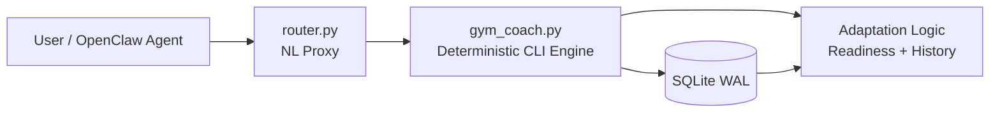

<div align="center">
  

  # OpenGym
  **Local-first AI fitness engineering with deterministic, science-backed logic**

  [](#)
  [](https://github.com/lev1nson/OpenGym/stargazers)
  [](https://github.com/lev1nson/OpenGym/network/members)
  [](CONTRIBUTING.md)
  [](LICENSE)
</div>

OpenGym is a practical foundation for building an AI-native training system where reasoning is transparent, safety constraints are explicit, and product behavior remains deterministic under real-world usage.

The repository combines:

- a production-proven gym-coach skill architecture,
- a science-rulebook direction (`gym-coach-brain`),
- and strong GitHub documentation culture for rapid, reliable iteration.

---

## Why this project exists

Most AI fitness assistants fail for one reason: probabilistic outputs are asked to make deterministic training decisions.

OpenGym is built to solve that architecture mismatch.

- **Deterministic training logic first** (progression, volume control, readiness).
- **LLM/NL as interface layer**, not as final authority over load decisions.
- **Science-backed constraints** as explicit configuration and documented method.
- **Local-first operation** to keep athlete data private and portable.

---

## What is implemented today

### Core product capabilities

- **Natural language workout control** (RU/EN mixed input) through [`workspace/skills/gym-coach/router.py`](workspace/skills/gym-coach/router.py)
- **Structured CLI engine** in [`workspace/skills/gym-coach/gym_coach.py`](workspace/skills/gym-coach/gym_coach.py)
- **Training session lifecycle**: start/status/set/done/pause/resume/abort/undo
- **Program workflow**: import/show/analyze/next
- **Science-oriented adaptation logic** (deterministic recommendation engine)
- **Readiness logging + historical context** for decision support
- **SQLite persistence with WAL mode** for robust local operation

### Product documentation assets

- Architecture deep-dive: [`docs/architecture.md`](docs/architecture.md)
- System overview: [`docs/project-overview.md`](docs/project-overview.md)
- Contracts and data model docs: [`docs/api-contracts.md`](docs/api-contracts.md), [`docs/data-models.md`](docs/data-models.md)
- Technology decisions: [`docs/technology-stack.md`](docs/technology-stack.md)
- Planning and research artifacts: [`_bmad-output/`](_bmad-output)

---

## Architecture snapshot



Design principle: **probabilistic input, deterministic execution**.

---

## Why OpenGym is unique

1. **Deterministic core + AI interface split**
   - Clear separation between intent parsing and training decisions reduces hallucination risk.

2. **Science evidence orientation**
   - Methodology is treated as a first-class artifact (see [`gym-coach-brain/ScienceEvidence.md`](gym-coach-brain/ScienceEvidence.md)).

3. **Local-first by default**
   - No mandatory cloud stack for core behavior; privacy and operational control remain with the athlete/team.

4. **Transparent engineering culture**
   - Docs include architecture, known issues, trade-offs, and roadmap rather than marketing-only claims.

5. **Migration path, not rewrite fantasy**
   - The repo captures both current working system and planned modular evolution.

---

## Quality and transparency posture

- Current architecture and known debt are openly documented in [`docs/index.md`](docs/index.md).
- Severity matrix and refactoring priorities are explicit in [`docs/architecture.md`](docs/architecture.md).
- Engineering decisions are traceable through [`CHANGELOG.md`](CHANGELOG.md) and [`_bmad-output/`](_bmad-output).

This makes the project reviewable, forkable, and easier to evolve safely.

---

## Repository structure

```text
OpenGym/
├─ assets/                # logos, visual assets
├─ docs/                  # architecture, contracts, data model, guides
├─ prompts/               # LLM behavior and task prompt templates
├─ gym-coach-brain/       # modular next-step package direction
├─ workspace/skills/gym-coach/  # current working skill implementation
├─ _bmad-output/          # planning/research/implementation artifacts
├─ CHANGELOG.md
├─ CONTRIBUTING.md
├─ LICENSE
└─ README.md
```

---

## Quick Start

```bash
# 1) Clone the repository
git clone <your-repo-url>
cd OpenGym

# 2) Create your working branch
git checkout -b chore/bootstrap-project

# 3) Explore docs first
# - docs/index.md
# - docs/architecture.md

# 4) Run/inspect the current skill implementation
# (from workspace/skills/gym-coach)
```

---

## Roadmap status

The project is in active build/refactor phase:

- **Current state:** working monolith skill with real functionality.
- **In progress:** extracting a cleaner modular architecture in [`gym-coach-brain/`](gym-coach-brain).
- **Focus:** reliability, test coverage, and deterministic safety guarantees.

---

## Best practices for contributors

- Keep [`README.md`](README.md) focused on **problem → solution → value**.
- Treat architecture and contract docs as production artifacts.
- Version prompt and behavior changes like code changes.
- Update [`CHANGELOG.md`](CHANGELOG.md) on every meaningful iteration.
- Use pull requests to preserve decision history and review quality.

---

## Next high-impact improvements

- [ ] Expand automated tests for parser and adaptation edge cases
- [ ] Add stronger CI quality gates
- [ ] Continue monolith-to-modular extraction in [`gym-coach-brain/`](gym-coach-brain)
- [ ] Add release versioning and changelog discipline for milestones

---

## Contributing

Read [`CONTRIBUTING.md`](CONTRIBUTING.md) before opening a pull request.

## License

MIT. See [`LICENSE`](LICENSE).
